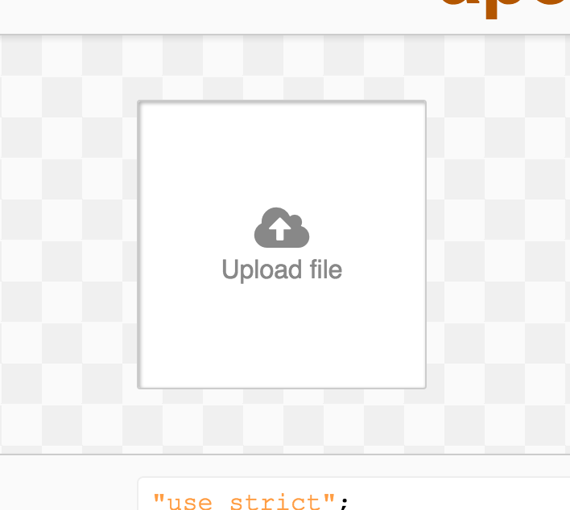

apeman-react-upload
==========

<!---
This file is generated by ape-tmpl. Do not update manually.
--->

<!-- Badge Start -->
<a name="badges"></a>

[![Build Status][bd_travis_shield_url]][bd_travis_url]
[![Code Climate][bd_codeclimate_shield_url]][bd_codeclimate_url]
[![Code Coverage][bd_codeclimate_coverage_shield_url]][bd_codeclimate_url]
[![npm Version][bd_npm_shield_url]][bd_npm_url]
[![JS Standard][bd_standard_shield_url]][bd_standard_url]

[bd_repo_url]: https://github.com/apeman-react-labo/apeman-react-upload
[bd_travis_url]: http://travis-ci.org/apeman-react-labo/apeman-react-upload
[bd_travis_shield_url]: http://img.shields.io/travis/apeman-react-labo/apeman-react-upload.svg?style=flat
[bd_travis_com_url]: http://travis-ci.com/apeman-react-labo/apeman-react-upload
[bd_travis_com_shield_url]: https://api.travis-ci.com/apeman-react-labo/apeman-react-upload.svg?token=
[bd_license_url]: https://github.com/apeman-react-labo/apeman-react-upload/blob/master/LICENSE
[bd_codeclimate_url]: http://codeclimate.com/github/apeman-react-labo/apeman-react-upload
[bd_codeclimate_shield_url]: http://img.shields.io/codeclimate/github/apeman-react-labo/apeman-react-upload.svg?style=flat
[bd_codeclimate_coverage_shield_url]: http://img.shields.io/codeclimate/coverage/github/apeman-react-labo/apeman-react-upload.svg?style=flat
[bd_gemnasium_url]: https://gemnasium.com/apeman-react-labo/apeman-react-upload
[bd_gemnasium_shield_url]: https://gemnasium.com/apeman-react-labo/apeman-react-upload.svg
[bd_npm_url]: http://www.npmjs.org/package/apeman-react-upload
[bd_npm_shield_url]: http://img.shields.io/npm/v/apeman-react-upload.svg?style=flat
[bd_standard_url]: http://standardjs.com/
[bd_standard_shield_url]: https://img.shields.io/badge/code%20style-standard-brightgreen.svg

<!-- Badge End -->


<!-- Description Start -->
<a name="description"></a>

apeman react package for file upload components.

<!-- Description End -->


<!-- Overview Start -->
<a name="overview"></a>


<!-- Overview End -->


<!-- Sections Start -->
<a name="sections"></a>

<!-- Section from "doc/guides/01.Installation.md.hbs" Start -->

<a name="section-doc-guides-01-installation-md"></a>

Installation
-----

```bash
$ npm install apeman-react-upload --save
```


<!-- Section from "doc/guides/01.Installation.md.hbs" End -->

<!-- Section from "doc/guides/02.Demo.md.hbs" Start -->

<a name="section-doc-guides-02-demo-md"></a>

Demo
-----

[Live demo][demo_url] is hosted on GitHub Pages.

[][demo_url]

[demo_url]: http://apeman-react-labo.github.io/apeman-react-upload/demo/demo.html


<!-- Section from "doc/guides/02.Demo.md.hbs" End -->

<!-- Section from "doc/guides/03.Usage.md.hbs" Start -->

<a name="section-doc-guides-03-usage-md"></a>

Usage
---------

```jsx
'use strict'

import React from 'react'
import {ApUpload, ApUploadStyle} from 'apeman-react-upload'

const ExampleComponent = React.createClass({
  render () {
    const s = this
    return (
      <div>
        <ApUploadStyle/>
        <ApUpload multiple={ false }
                  id="demo-file-upload-01"
                  name="file-input-01"
                  accept="image/*"
                  onLoad={ s.handleLoaded }
                  onError={ s.handleError }/>
      </div>
    )
  },
  handleLoaded (urls) {
    console.log('Image urls:', urls)
    /* ... */
  },
  handleError (err) {
    /* ... */
  }
})

```


<!-- Section from "doc/guides/03.Usage.md.hbs" End -->

<!-- Section from "doc/guides/04.Components.md.hbs" Start -->

<a name="section-doc-guides-04-components-md"></a>

Components
-----


### ApUploadStyle

**Props**

| Name | Type | Default | Description |
| ---- | ---- | ------- | ----------- |
| style | object | {} | |  |
| highlightColor | string | ApStyle.DEFAULT_HIGHLIGHT_COLOR | |  |
| backgroundColor | string | ApStyle.DEFAULT_BACKGROUND_COLOR | |  |

### ApUpload

**Props**

| Name | Type | Default | Description |
| ---- | ---- | ------- | ----------- |
| name | string | null | | Name of input |
| id | string | &#x60;ap-upload-${uuid.v4()}&#x60; | | DOM id of input |
| multiple | bool | false | | Allow multiple upload |
| onChange | func | null | | Handler for change event |
| onLoad | func | null | | Handler for load event |
| onError | func | null | | Handler for error event |
| width | number | 180 | | Image width |
| height | number | 180 | | Image height |
| text | string | &#x27;Upload file&#x27; | | Guide text |
| accept | string | null | | Accept file type |
| icon | string | &#x27;fa fa-cloud-upload&#x27; | | Guide icon |
| closeIcon | string | &#x27;fa fa-close&#x27; | | Icon for close images |
| spinner | string |  | | Spinner theme |
| value | string|array |  | | Value of input |
| spinnerIcon |  | ApSpinner.DEFAULT_THEME | |  |


<!-- Section from "doc/guides/04.Components.md.hbs" End -->


<!-- Sections Start -->


<!-- LICENSE Start -->
<a name="license"></a>

License
-------
This software is released under the [MIT License](https://github.com/apeman-react-labo/apeman-react-upload/blob/master/LICENSE).

<!-- LICENSE End -->


<!-- Links Start -->
<a name="links"></a>

Links
------

+ [apeman][apeman_url]
+ [apeman-react-labo][apeman_react_labo_url]
+ [React][react_url]

[apeman_url]: https://github.com/apeman-labo/apeman
[apeman_react_labo_url]: https://github.com/apeman-react-labo
[react_url]: https://facebook.github.io/react/

<!-- Links End -->
